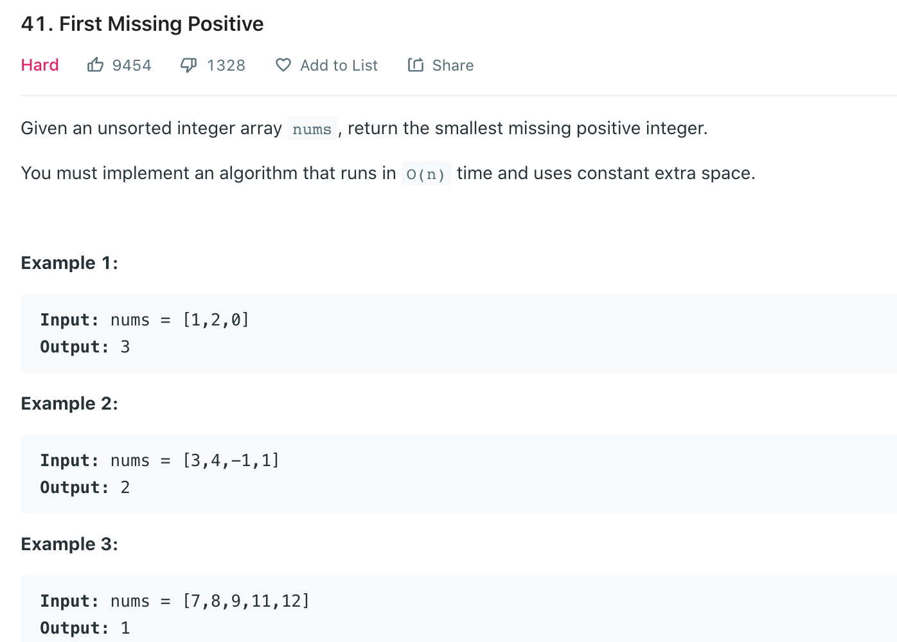

# Index

| Date | Day | Status |
| ----------- | ----------- | ----------- |
| 05/09 | Monday | [Done](#0509) |
| 05/10 | Tuesday | [Not started](#0510) |
| 05/11 | Wedensday | [Not started](#0511) |
| 05/12 | Thursday | [Not started](#0512) |
| 05/13 | Friday | [Not started](#0513) |

# 05/09

## 41. [First Missing Positive](https://leetcode.com/problems/first-missing-positive/)

Problem.



### Python
```python
class Solution:
    def firstMissingPositive(self, nums: List[int]) -> int:
        # directly 
        nums = sorted(nums)
        ans = 1
        for num in nums:
            if num > 0 and num == ans:
                ans += 1
        return ans
```

### Python
fellow up: time complexity == O(N)
```python
class Solution:
    def firstMissingPositive(self, nums: List[int]) -> int:
        if 1 not in nums:
            return 1
        length = len(nums)
        ans = 1
        
        # change negative and num > length:
        for j in range(length):
            if nums[j] <= 0 or nums[j] > length:
                nums[j] = 1
        for num in nums:
            tem = abs(num)
            if tem == length:
                ans = -1
            else:
                nums[tem] = -abs(nums[tem])
             
        for i in range(1, length):
            if nums[i] > 0:
                return i
        if ans > 0:
            return length
        return length + 1
            
```