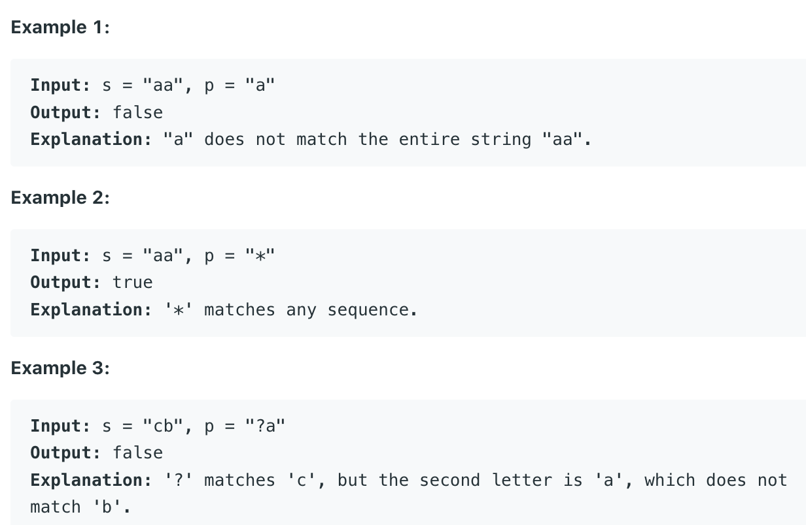

# Index

| Date | Day | Status |
| ----------- | ----------- | ----------- |
| 05/09 | Monday | [Done](#0509) |
| 05/10 | Tuesday | [Done](#0510) |
| 05/11 | Wedensday | [Not started](#0511) |
| 05/12 | Thursday | [Not started](#0512) |
| 05/13 | Friday | [Not started](#0513) |

# 05/09

## 41. [First Missing Positive](https://leetcode.com/problems/first-missing-positive/)

Problem.


### Python
```python
class Solution:
    def firstMissingPositive(self, nums: List[int]) -> int:
        # directly 
        nums = sorted(nums)
        ans = 1
        for num in nums:
            if num > 0 and num == ans:
                ans += 1
        return ans
```

### Python
fellow up: time complexity == O(N)
```python
class Solution:
    def firstMissingPositive(self, nums: List[int]) -> int:
        if 1 not in nums:
            return 1
        length = len(nums)
        ans = 1
        
        # change negative and num > length:
        for j in range(length):
            if nums[j] <= 0 or nums[j] > length:
                nums[j] = 1
        for num in nums:
            tem = abs(num)
            if tem == length:
                ans = -1
            else:
                nums[tem] = -abs(nums[tem])
             
        for i in range(1, length):
            if nums[i] > 0:
                return i
        if ans > 0:
            return length
        return length + 1
            
```

# 05/10

## 44. [Wildcard Matching](https://leetcode.com/problems/wildcard-matching/)

Problem

Given an input string (s) and a pattern (p), implement wildcard pattern matching with support for '?' and '*' where:

'?' Matches any single character.

'*' Matches any sequence of characters (including the empty sequence).

The matching should cover the entire input string (not partial).


### Python
```python
class Solution:
    def isMatch(self, s: str, p: str) -> bool:
        # Dynamic programming
        # Method cited from the solution of leetcode
        slen = len(s)
        plen = len(p)
        
        if p == s or set(p) == {'*'}:
            return True
        if p == '' or s == '':
            return False
        
        d = [[False] * (slen + 1) for _ in range(plen + 1)]
        d[0][0] = True
        for p_idx in range(1, plen + 1):
            # print(p)
            # print(p_idx-1)
            if p[p_idx - 1] == '*':
                s_idx = 1
                
                while not d[p_idx - 1][s_idx - 1] and s_idx < slen + 1:
                    s_idx += 1
                d[p_idx][s_idx - 1] = d[p_idx - 1][s_idx - 1]
                
                while s_idx < slen + 1:
                    d[p_idx][s_idx] = True
                    s_idx += 1
            elif p[p_idx - 1]== '?':
                for s_idx in range(1, slen+1):
                    d[p_idx][s_idx] = d[p_idx - 1][s_idx - 1]
            else:
                for s_idx in range(1, slen+1):
                    d[p_idx][s_idx] = d[p_idx - 1][s_idx - 1] and p[p_idx -1]== s[s_idx - 1]
        return d[plen][slen]
```